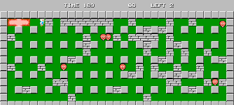
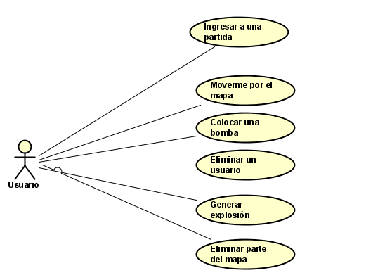

# BomberBattle :bomb:
## Autor : Daniel Santiago Ducuara Ardila

## Resumen :exclamation:
BomberBattle es un juego multijugador de estrategia en el que el ganador de cada partida es
quien sobreviva a los múltiples ataques de sus enemigos.

## Descripción :page_facing_up:

BomberBattle está basado en el juego arcade Bomberman.

 

- Usuario: Cada jugador debe ingresar un nombre de usuario.
- Partida: Una vez empiece la partida los jugadores empezarán a eliminarse hasta que quede un usuario.
- Bomba: Un jugador puede colocar una bomba cada 3 segundos y el tamaño de la bomba irá aumentando progesivamente con el 
  paso de la partida.
 -Mapa: El mapa irá generando bombas para ir reduciendo su tamaño y agilizar la partida.

## Historias de usuario :runner:

 

### Ingresar a una partida

Como usuario
Quiero ingresar a una partida
Para poder empezar el juego
criterios de aceptación
El usuario ingresará a una partida cuando se completen 4 usuarios esperando .

### Moverse por el mapa

Como Usuario
Quiero moverme por el mapa
Para poder colocar bombas en todo el mapa.
criterios de aceptación
El usuario debe poder moverse dentro del mapa.

### Colocar una bomba

Como Usuario
Quiero colocar una bomba
Para poder generar una explosión.
criterios de aceptación
Se debe colocar una bomba cada 3 segundos y en zonas libres del mapa.
La bomba debe explotar según un tamaño.

### Eliminar usuario

Como Usuario
Quieroeliminar usuarios
Para poder ganar la partida.
criterios de aceptación
El usuario debe quedar eliminado si el rango de una bomba lo alcanza.

### Generar explosión

Como Usuario
Quiero que se genere una explosión
Para poder eliminar los demás usuarios.
criterios de aceptación
el tamaño de la explosión irá aumentando con el paso del tiempo.
Si la explosión alcanza un jugador será eliminado.

### Eliminar parte del mapa

Como Usuario
Quiero que se elimine parte del mapa
Para poder agilizar la partida
criterios de aceptación
En el mapa aparederán bombas que cortaran parte del mapa para reducir 
el tamaño y agilizar la partida.